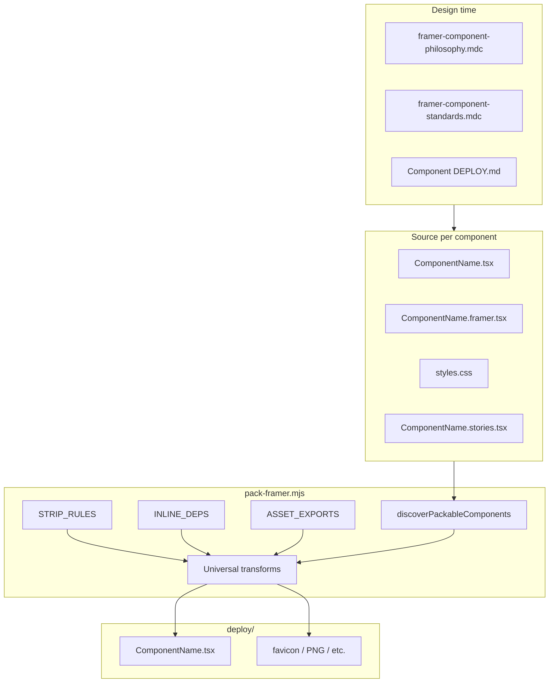

# Framer Deployment Strategy

This document describes how components in this repo are prepared for Framer: the shared pack pipeline, per-component exceptions, and where to add new requirements.

## Overview

Deploy artifacts live under `deploy/` (gitignored except `deploy/README.md`). They are **generated**, not edited by hand.

```bash
npm run pack:framer                    # pack all packable components
npm run pack:framer -- ComponentName   # pack one component
```

Output is written to `deploy/<ComponentName>/`. For most components that is a single paste target:

```
deploy/<ComponentName>/<ComponentName>.tsx
```

Some components also emit static assets (see [Asset exports](#asset-exports)).

---

## Architecture

Deploy uses a **layered strategy**: one universal pipeline, plus explicit per-component registries and source conventions.



---

## Layer 1: Shared baseline

### Cursor and repo rules

| Rule file | Role |
| --- | --- |
| `.cursor/rules/framer-component-philosophy.mdc` | Defaults, designer-facing controls, mobile-first, graceful degradation |
| `.cursor/rules/framer-component-standards.mdc` | Folder layout, Storybook expectations, a11y and performance |
| `.docs/framer.md` | Broader component system philosophy and standards |

These govern **how components are authored**, not how the pack script runs.

### Packable component contract

A folder under `src/components/` is packable when it contains:

| File | Role |
| --- | --- |
| `ComponentName.tsx` | Implementation (no `framer` import) |
| `ComponentName.framer.tsx` | `addPropertyControls` only |
| `styles.css` | Styles for Storybook/Vite; inlined at pack time |

Optional but typical: `ComponentName.stories.tsx`, `index.ts`, `DEPLOY.md`.

### `PACKED_STYLES` convention

Every packable component should include:

```tsx
import './styles.css';

const PACKED_STYLES = '';

function ComponentNameStyles() {
  if (!PACKED_STYLES) return null;
  return <style>{PACKED_STYLES}</style>;
}
```

At pack time, `scripts/pack-framer.mjs` replaces `PACKED_STYLES = ''` with an inlined CSS template literal and removes `import './styles.css'`. Framer cannot rely on separate CSS files on the published site.

### Universal pack pipeline

For every packable component, `packComponent()` in [`scripts/pack-framer.mjs`](../scripts/pack-framer.mjs) runs:

| Step | Function | Purpose |
| --- | --- | --- |
| 1 | `inlineDependencies` | Merge sibling components listed in `INLINE_DEPS` |
| 2 | `stripForFramer` | Apply per-component string fixes from `STRIP_RULES` |
| 3 | `inlineStyles` | Embed CSS into `PACKED_STYLES` |
| 4 | `hoistImports` | Move ESM imports (e.g. `react`) to the top of the file |
| 5 | `prepareComponentForDeploy` | Change `export function ComponentName` → `function ComponentName` |
| 6 | `extractFramerControls` | Append controls from `.framer.tsx`; strip relative imports |
| 7 | `exportComponentAssets` | Write extra files if listed in `ASSET_EXPORTS` |

The deploy `.tsx` file ends with a single `export default ComponentName` and only **external** imports Framer expects (`react`, `framer`, `framer-motion`, etc.)—no `./` or `../` component paths.

---

## Layer 2: Per-component registries

Unique deploy needs are **opt-in** entries in [`scripts/pack-framer.mjs`](../scripts/pack-framer.mjs). They are not inferred automatically.

### `STRIP_RULES`

Transforms source before paste when Vite-specific assets or paths must be removed.

| Component | Behavior |
| --- | --- |
| `FlipCard` | Strip `hero.png` import; use empty string for default image |

Add a new entry when a component imports build-time assets that Framer cannot resolve.

### `INLINE_DEPS`

Bundle child component source (and optional CSS) into the parent paste file.

| Parent | Inlined dependency |
| --- | --- |
| `OmPricingSection` | `OmPricingTierCard` (+ tier CSS) |

Each entry specifies:

- `component` — folder name under `src/components/`
- `importPattern` — regex to remove the import from the parent
- `cssImportPattern` — optional regex for sibling CSS import

Child CSS is only read if `styles.css` exists (optional for deps without CSS).

**Note:** `OmLogo` intentionally does **not** use `INLINE_DEPS`. Its squircle icon is co-located in `OmLogo.tsx` to avoid relative imports in the Framer paste file.

### `ASSET_EXPORTS`

Copy or rasterize static brand files into `deploy/<ComponentName>/` on pack.

| Component | Source | Outputs |
| --- | --- | --- |
| `SearchSquircleIcon` | `search-squircle-icon.svg` | `favicon.svg`, `search-squircle-icon-192.png`, `search-squircle-icon-512.png` |

PNG generation uses the `sharp` devDependency. SVG geometry must be kept in sync with `SearchSquircleIcon.tsx` manually.

**Scope choice:** pack does **not** overwrite `public/favicon.svg`. Copy from `deploy/SearchSquircleIcon/favicon.svg` manually if needed for the Vite app (`index.html` already references `/favicon.svg`).

---

## Layer 3: Per-component source design

Most requirements live in component code and Framer property files, not in the pack script.

| Component | Requirement | Where it lives |
| --- | --- | --- |
| `SearchSquircleIcon` | Background, icon color, size, label | `SearchSquircleIcon.framer.tsx` |
| `SearchSquircleIcon` | Favicon / PNG artwork | `search-squircle-icon.svg` + `ASSET_EXPORTS` |
| `OmLogo` | Single-file paste (no cross-imports) | Private `OmLogoSquircleIcon` inside `OmLogo.tsx` |
| `OmLogo` | One **Size** control scales wordmark + icon | `logoSize` prop; `displayFontSize: false` on Font control |
| `OmLogo` | Optional name; Site Variable workflow | `name` control + description in `.framer.tsx` |
| `FlipCard` | Motion, images, large control surface | `FlipCard.tsx` + `FlipCard.framer.tsx` + `STRIP_RULES` |
| `OmPricingSection` | Section + inlined tiers | `INLINE_DEPS` + section `.framer.tsx` |
| `OmPricingTierCard` | Standalone tier card | Packable on its own or only via section inline |

### `.framer.tsx` split

- **`ComponentName.tsx`** — portable React; used by Storybook and Vite.
- **`ComponentName.framer.tsx`** — imports from `./ComponentName` only; exports default + `addPropertyControls`.

The pack script merges controls into the deploy file and strips `./` / `../` imports so constants like `DEFAULT_NAME` resolve from the inlined body above.

### Storybook

`*.stories.tsx` validates behavior locally. Stories do not affect deploy output except by keeping source correct before pack.

---

## Layer 4: Human deploy guides

When steps differ from “paste one `.tsx`”, document them in `src/components/<Name>/DEPLOY.md`:

| Component | Guide |
| --- | --- |
| FlipCard | [`src/components/FlipCard/DEPLOY.md`](../src/components/FlipCard/DEPLOY.md) |
| OmLogo | [`src/components/OmLogo/DEPLOY.md`](../src/components/OmLogo/DEPLOY.md) |
| SearchSquircleIcon | [`src/components/SearchSquircleIcon/DEPLOY.md`](../src/components/SearchSquircleIcon/DEPLOY.md) |

Generated output layout is summarized in [`deploy/README.md`](../deploy/README.md).

---

## Current packable components

Auto-discovered when all three required files exist:

- `FlipCard`
- `OmLogo`
- `OmPricingSection`
- `OmPricingTierCard`
- `SearchSquircleIcon`

Run `npm run pack:framer` to pack all, or `npm run pack:framer -- Name` for one.

---

## Workflow checklist

### Standard component deploy

1. Implement under `src/components/MyWidget/` (tsx, framer, css, stories).
2. Add `PACKED_STYLES` injector pattern.
3. Run `npm run pack:framer -- MyWidget`.
4. Paste `deploy/MyWidget/MyWidget.tsx` into Framer (**Assets → Code**).
5. Verify canvas preview and published preview.

### When you need something special

| Need | Action |
| --- | --- |
| Strip Vite-only imports/assets | Add to `STRIP_RULES` |
| Bundle another component into one file | Add to `INLINE_DEPS` |
| Favicon, PNG, or other static exports | Add to `ASSET_EXPORTS` + source SVG/asset file |
| Avoid Framer relative imports | Co-locate code in one `.tsx` (OmLogo pattern) or use `INLINE_DEPS` |
| Manual site steps | Document in `DEPLOY.md` |

---

## Known limits

- **No per-component rule DSL** — registries are plain JS objects in `pack-framer.mjs`, not a config file per folder.
- **No automatic SVG ↔ TSX sync** — static assets and React SVG markup are maintained separately unless you add generation later.
- **Framer cannot read site/project name** — use a String control + Site Variable binding (documented on `OmLogo`).
- **`deploy/` is gitignored** — re-run pack after source changes; do not treat deploy files as source of truth.

---

## Future direction (optional)

To scale beyond hand-maintained registries, a natural evolution is a **`deploy.config.json` (or `.mjs`) per component folder** read by `pack-framer.mjs`, consolidating `STRIP_RULES`, `INLINE_DEPS`, and `ASSET_EXPORTS` next to the component. Today that role is split between the pack script and `DEPLOY.md`.

---

## Related files

| Path | Purpose |
| --- | --- |
| [`scripts/pack-framer.mjs`](../scripts/pack-framer.mjs) | Pack pipeline and registries |
| [`deploy/README.md`](../deploy/README.md) | Generated output layout |
| [`package.json`](../package.json) | `npm run pack:framer` script |
| [`.docs/framer.md`](./framer.md) | Component authoring philosophy |
