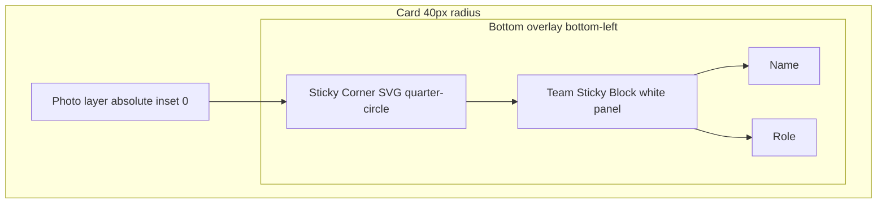

# Framer Inverted Corner Analysis

Reverse-engineering of the profile-card “scoop” effect on the OfferMode Framer site, based on SSR HTML/CSS inspection (April 2026).

## Source

| Item | Value |
|------|--------|
| Live URL | [https://logical-humans-236491.framer.app/](https://logical-humans-236491.framer.app/) |
| Section | `[data-framer-name="Team Section"]` (`#team`) |
| Grid | `[data-framer-name="Team Grid"]` inside `[data-framer-name="Container"]` |
| Card component | `.framer-k1g5h` (Framer component instance) |
| Breakpoint wrapper | `.ssr-variant.hidden-1uiypot` → visible at `max-width: 809.98px` (phone); desktop/tablet use sibling variants with the same card structure |

Example card inspected: **Jason Lee / Front-End Developer** in the Team Grid.

## Visual goal

The reference profile card shows:

1. Full-bleed photo with **40px** rounded outer corners
2. A **white label panel** flush to the bottom-left
3. A **concave (inverted) curve** where the panel meets the photo—not a simple 90° corner
4. **Name + role** only on the front; no dark gradient over the text area



## DOM tree (annotated)

Path from Team Section to the card with the scoop CSS:

```
[data-framer-name="Team Section"]#team
└── [data-framer-name="Container"]
    └── [data-framer-name="Team Grid"]
        └── .ssr-variant.hidden-1uiypot          ← responsive variant wrapper
            └── .framer-*-container
                └── .framer-k1g5h                 ← CARD ROOT (309×400, 40px radius)
                    │
                    ├── [background image wrapper]
                    │     position: absolute; inset: 0
                    │     border-radius: inherit
                    │     corner-shape: inherit
                    │     └──  object-fit: cover; border-radius: inherit
                    │
                    └── .framer-15wqdho            ← bottom overlay (flex row)
                          position: absolute; bottom: 0; left: 0
                          └── .framer-69d0uk      ← column stack
                                ├── [data-framer-name="Sticky Corner"]
                                │     40×40 container, often rotate(90deg)
                                │     └── inline SVG quarter-circle (#fcfcfc)
                                │
                                └── [data-framer-name="Team Sticky Block"]
                                      background: rgb(252, 252, 252)
                                      border-top-right-radius: 40px
                                      ├── title (RichTextContainer)
                                      └── subtitle (RichTextContainer)
```

Some variants add a **second** `[data-framer-name="Sticky Corner"]` sibling (e.g. `.framer-7kyiw7-container`) beside the column for wider layouts.

## Layer breakdown

### 1. Card root (`.framer-k1g5h`)

Compiled CSS (abridged):

```css
.framer-k1g5h.framer-132zl8h {
  width: 309px;
  height: 400px;
  position: relative;
  overflow: visible;
}
```

Inline on the element:

```css
border-bottom-left-radius: 40px;
border-bottom-right-radius: 40px;
border-top-left-radius: 40px;
border-top-right-radius: 40px;
```

The card does **not** rely on a single overflow-hidden box for the scoop; the bottom overlay is `overflow: visible` so the SVG filler can sit in the junction.

### 2. Photo layer

```html
<div style="position:absolute;border-radius:inherit;corner-shape:inherit;inset:0"
     data-framer-background-image-wrapper="true">
  
</div>
```

The image fills the card and inherits the 40px radius on the outer clip. The scoop is **not** carved out of the image with `clip-path`; the white SVG + panel sit on top.

### 3. Sticky Corner (the scoop)

Framer embeds a small SVG component named **Sticky Corner**:

```html
<div data-framer-name="Sticky Corner" style="transform: rotate(90deg)">
  <svg width="40" height="40" viewBox="0 0 40 40" xmlns="http://www.w3.org/2000/svg">
    <path d="M40 40V0C40 22.0914 22.0914 40 0 40H40Z" fill="#fcfcfc"/>
  </svg>
</div>
```

- **Size:** 40×40px (`aspect-ratio: 1`, height from `--framer-aspect-ratio-supported, 40px`)
- **Fill:** `#fcfcfc` — matches the label panel (`rgb(252, 252, 252)`)
- **Rotation:** `rotate(90deg)` on the container orients the wedge for the top-right junction of the white block

### 4. Team Sticky Block (label panel)

```html
<div data-framer-name="Team Sticky Block"
     style="background-color: rgb(252, 252, 252); border-top-right-radius: 40px">
  …title…
  …subtitle…
</div>
```

Compiled CSS:

```css
.framer-k1g5h .framer-xya9ys {
  flex-flow: column;
  align-items: flex-start;
  min-height: 80px;
  padding: 12px 20px 0 0;
  overflow: hidden;
}
```

Only **border-top-right-radius: 40px** is set on the panel. The bottom-left corner of the panel aligns with the card’s bottom-left 40px radius by position (flush to `bottom: 0; left: 0`), not by a second radius on the panel.

## SVG path explained

```svg
<path d="M40 40 V0 C40 22.0914 22.0914 40 0 40 H40 Z" fill="#fcfcfc"/>
```

| Segment | Effect |
|---------|--------|
| `M40 40` | Start at bottom-right of 40×40 viewBox |
| `V0` | Line to top-right |
| `C40 22.0914 22.0914 40 0 40` | Cubic curve bulging inward — **concave** quarter circle |
| `H40 Z` | Close along bottom edge |

This is the classic **inverted border-radius filler**: a solid quarter-disc that visually “bites” into the image area when placed above the photo and beside the white rectangle.

**Why rotate 90°?** The path is authored for one corner orientation; Framer rotates the 40×40 box so the curve sits between the image (above/right) and the label panel (below/left).

## Typography (Framer site vs FlipCard)

| Element | Framer (Team card) | Our FlipCard default |
|---------|-------------------|----------------------|
| Name | preset `ldpjhr` → **20px**, Archivo, `rgb(66,66,66)` | **24px**, `#111827` |
| Role | preset `d665x4` → **16px**, Archivo, `rgb(117,117,117)` | **15px** (`0.9375rem`), `#6b7280` |

Framer’s live site uses slightly smaller type than our FlipCard spec; our 24px title is an intentional product choice, not a pixel-match to the template.

## What Framer does *not* use on these cards

| Technique | Used on Team cards? |
|-----------|---------------------|
| `radial-gradient` scoop pseudo | No |
| `clip-path` on image for junction | No |
| `mask-image` composite | No |
| `corner-shape: scoop` on panel | No (only `inherit` on image wrapper) |

Global Framer CSS includes `@supports (corner-shape: superellipse(2))` for future rounded corners; the **visible** Team card scoop comes from **SVG + panel**, not from `corner-shape` alone.

## Comparison: Framer vs FlipCard

| Aspect | OfferMode Framer site | FlipCard ([`styles.css`](../src/components/FlipCard/styles.css)) |
|--------|----------------------|-------------------------------------------------------------------|
| Scoop mechanism | Inline **SVG path** (40×40, rotated) | **`.flip-card__label-panel::before` / `::after`** with `box-shadow` (see [`.testHtmlFiles/example1.html`](../.testHtmlFiles/example1.html)) |
| Label panel | `Team Sticky Block`, `border-top-right-radius: 40px` | `.flip-card__label-panel`, `border-top-right-radius` + `border-bottom-left-radius` match card |
| Panel padding | `12px 20px 0 0` + scoop in flex layout | Uniform padding; scoop is CSS-only (no extra top padding) |
| Image | Absolute, `border-radius: inherit` | `.flip-card__image-wrap` clips with `border-radius` |
| Outer radius | 40px all corners | `--flip-radius: 40px` default |
| Fallback | N/A | `panelScoopRadius: 0` → simple `border-top-right-radius` on panel |

FlipCard intentionally uses the **box-shadow pseudo-element technique** from `example1.html`, not the live Framer SVG wedges—both achieve an inverted corner; the CSS approach keeps the component self-contained without inline SVG assets.

**Visual parity:** The SVG approach on the live site tends to match Framer exports most closely. The box-shadow technique tracks `frontPanelColor` via `var(--flip-panel-bg)` and avoids extra DOM nodes.

**Optional follow-up:** Add an SVG corner variant for closer parity with Framer exports if designers need pixel-perfect match to OfferMode.

## Porting guide (without Framer)

To replicate in plain HTML/CSS/React:

1. **Card** — `position: relative`, `border-radius: 40px`, fixed aspect ratio.
2. **Image** — `position: absolute; inset: 0; object-fit: cover; border-radius: 40px`.
3. **Bottom row** — `position: absolute; bottom: 0; left: 0; display: flex; align-items: flex-end`.
4. **Scoop** — 40×40 box with the SVG path above (fill = panel background), optionally `transform: rotate(90deg)`.
5. **Panel** — white background, `border-top-right-radius: 40px`, padding, title + subtitle stacked.

Do **not** need Framer’s `data-framer-name` attributes or component classes—only the layering idea.

---

## Minimal reproduction (HTML + CSS)

Copy into a static HTML file or Storybook “HTML” story to validate the technique without Framer:

```html
<article class="profile-card">
  
  <div class="profile-card__bottom">
    <div class="profile-card__scoop" aria-hidden="true">
      <svg width="40" height="40" viewBox="0 0 40 40" xmlns="http://www.w3.org/2000/svg">
        <path
          d="M40 40V0C40 22.0914 22.0914 40 0 40H40Z"
          fill="#ffffff"
        />
      </svg>
    </div>
    <div class="profile-card__panel">
      <h3 class="profile-card__title">Jason Lee</h3>
      <p class="profile-card__role">Front-End Developer</p>
    </div>
  </div>
</article>
```

```css
.profile-card {
  position: relative;
  width: 309px;
  aspect-ratio: 309 / 400;
  border-radius: 40px;
  overflow: hidden;
  background: #eee;
}

.profile-card__photo {
  position: absolute;
  inset: 0;
  width: 100%;
  height: 100%;
  object-fit: cover;
  border-radius: 40px;
}

.profile-card__bottom {
  position: absolute;
  bottom: 0;
  left: 0;
  display: flex;
  flex-direction: row;
  align-items: flex-end;
  z-index: 2;
}

.profile-card__scoop {
  width: 40px;
  height: 40px;
  flex-shrink: 0;
  transform: rotate(90deg);
  margin-bottom: 0;
}

.profile-card__panel {
  background: #ffffff;
  border-top-right-radius: 40px;
  padding: 12px 20px 16px 0;
  min-height: 80px;
}

.profile-card__title {
  margin: 0;
  font-size: 20px;
  font-weight: 700;
  color: #424242;
}

.profile-card__role {
  margin: 0.25rem 0 0;
  font-size: 16px;
  color: #757575;
}
```

### React equivalent (structural only)

```tsx
export function ProfileCardScoop({
  image,
  title,
  role,
}: {
  image: string;
  title: string;
  role: string;
}) {
  return (
    <article className="profile-card">
      
      <div className="profile-card__bottom">
        <div className="profile-card__scoop" aria-hidden>
          <svg width={40} height={40} viewBox="0 0 40 40">
            <path
              d="M40 40V0C40 22.0914 22.0914 40 0 40H40Z"
              fill="#ffffff"
            />
          </svg>
        </div>
        <div className="profile-card__panel">
          <h3 className="profile-card__title">{title}</h3>
          <p className="profile-card__role">{role}</p>
        </div>
      </div>
    </article>
  );
}
```

Use the same CSS as above. Wire `fill` to a `panelColor` prop if the panel background is themeable.

---

## Inspection checklist

When verifying in DevTools on the live site:

1. Select **Team Section** → **Team Grid** → a card (`.framer-k1g5h`).
2. Confirm **40px** radius on the card root.
3. Find **Sticky Corner** — should contain the quarter-circle SVG, not a CSS gradient.
4. Find **Team Sticky Block** — white block with `border-top-right-radius: 40px`.
5. Confirm title/subtitle are **inside** the sticky block, not over the image with a text shadow.

---

## References

- Component rules: [framer.md](./framer.md)
- FlipCard implementation: [`src/components/FlipCard/`](../src/components/FlipCard/)
